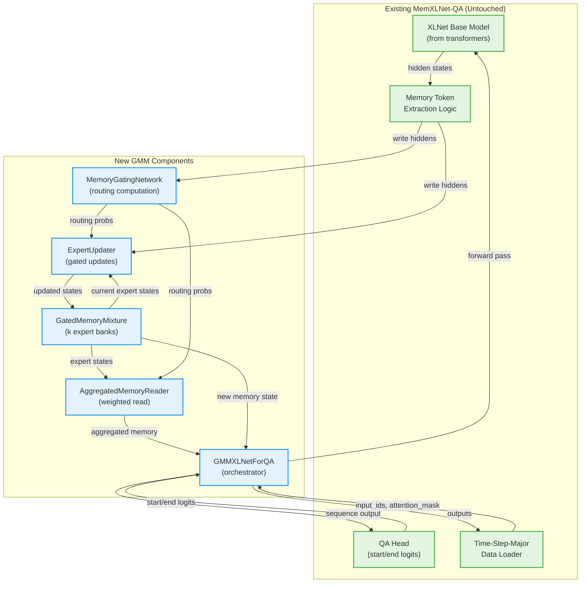

# Component Architecture

## New Components

### Component 1: GatedMemoryMixture

**Responsibility:** Manage k parallel memory expert banks with independent state tracking and initialization

**Integration Points:**
- Replaces single memory state management in `MemXLNetForQA`
- Provides unified interface for expert initialization, state access, and reset operations
- Integrates with existing memory token extraction logic

**Key Interfaces:**
- `__init__(num_experts, memory_slots, hidden_dim, init_strategies)` - Initialize k experts
- `get_expert_state(expert_idx)` → Tensor - Retrieve specific expert's memory
- `set_expert_state(expert_idx, state)` - Update specific expert's memory
- `reset_experts()` - Re-initialize all experts (for new document)
- `get_all_experts()` → List[Tensor] - Batch access to all expert states

**Dependencies:**
- **Existing Components:** None (pure PyTorch module)
- **New Components:** Used by `MemoryGatingNetwork` and `ExpertUpdater`

**Technology Stack:**
- PyTorch `nn.Module` for learnable initialization parameters
- Shape: Each expert maintains `(batch_size, memory_slots, hidden_dim)` tensor
- Initialization: Supports learned, zeros, uniform, orthogonal strategies per expert

**Initialization Strategies (Implementation Guidance):**
```python
# Example initialization logic for each strategy
if init_strategy == "learned":
    expert_params = nn.Parameter(torch.randn(memory_slots, hidden_dim) * 0.02)
elif init_strategy == "zeros":
    expert_params = nn.Parameter(torch.zeros(memory_slots, hidden_dim))
elif init_strategy == "uniform":
    expert_params = nn.Parameter(torch.rand(memory_slots, hidden_dim) * 0.1)
elif init_strategy == "orthogonal":
    # Orthogonal initialization ensures linear independence between experts
    expert_params = nn.Parameter(torch.empty(memory_slots, hidden_dim))
    nn.init.orthogonal_(expert_params)
```

**Rationale:** Different strategies encourage different types of specialization. Orthogonal initialization is particularly useful for ensuring experts start with maximally different representations.

---

### Component 2: MemoryGatingNetwork

**Responsibility:** Compute probability distribution over memory experts using content-based routing

**Integration Points:**
- Receives memory write proposals from XLNet hidden states
- Outputs routing probabilities used for expert update modulation
- Integrates with existing forward pass flow (called after base model processing)

**Key Interfaces:**
- `__init__(hidden_dim, num_experts, temperature, pooling_method)` - Initialize router
- `forward(memory_write_hiddens)` → (routing_probs, routing_logits, entropy) - Compute routing
- `get_routing_weights()` → Tensor - Access current routing distribution
- `compute_load_balance_loss(routing_probs)` → Tensor - Auxiliary loss for training

**Dependencies:**
- **Existing Components:** None (receives extracted hidden states)
- **New Components:** Outputs consumed by `ExpertUpdater` and `AggregatedMemoryReader`

**Technology Stack:**
- PyTorch `nn.Linear` for learnable W_gate matrix (k × d)
- Pooling: Mean-pooling over memory write token positions
- Softmax with configurable temperature for numerical stability
- Optional entropy regularization hook

---

### Component 3: ExpertUpdater

**Responsibility:** Implement expert-specific gated LSTM-style updates modulated by routing probabilities

**Integration Points:**
- Receives current expert states from `GatedMemoryMixture`
- Applies routing-modulated updates: (p_j · g_j) ⊙ u_j + (1 - p_j · g_j) ⊙ M_j^(i-1)
- Integrates with existing memory update logic (replaces single-memory gated update)

**Key Interfaces:**
- `__init__(hidden_dim, num_experts)` - Initialize per-expert gate networks
- `forward(experts, write_hiddens, routing_probs)` → List[Tensor] - Updated expert states
- `compute_expert_gates(expert_state, write_hidden)` → (gate, update) - Per-expert LSTM computation
- `apply_routing_modulation(gates, routing_probs)` → Tensor - Modulate gates with routing

**Dependencies:**
- **Existing Components:** Reuses LSTM gating logic patterns from existing `MemXLNetForQA`
- **New Components:** Receives routing from `MemoryGatingNetwork`, states from `GatedMemoryMixture`

**Technology Stack:**
- PyTorch `nn.ModuleList` of per-expert gate networks
- Each expert has separate W_g (gate) and W_u (update) parameter matrices
- Gradient flow through routing probabilities to gating network

**Step-by-Step Update Logic (Implementation Guidance):**
```python
def forward(self, expert_states, write_hiddens, routing_probs):
    """
    Apply routing-modulated gated updates to all experts.

    Args:
        expert_states: List[Tensor] - k expert memories, each (batch, memory_slots, hidden_dim)
        write_hiddens: Tensor - (batch, memory_slots, hidden_dim) - Proposed memory update
        routing_probs: Tensor - (batch, k) - Routing probabilities from gating network

    Returns:
        List[Tensor] - k updated expert memories
    """
    updated_experts = []

    for j in range(self.num_experts):
        # Step 1: Concatenate previous expert state with new proposal
        M_j_prev = expert_states[j]  # (batch, memory_slots, hidden_dim)
        combined = torch.cat([M_j_prev, write_hiddens], dim=-1)  # (batch, memory_slots, 2*hidden_dim)

        # Step 2: Compute per-expert LSTM-style gates
        g_j = torch.sigmoid(self.gate_networks[j](combined))  # (batch, memory_slots, hidden_dim)
        u_j = torch.tanh(self.update_networks[j](combined))   # (batch, memory_slots, hidden_dim)

        # Step 3: Extract routing probability for this expert
        p_j = routing_probs[:, j]  # (batch,)
        p_j = p_j.view(-1, 1, 1)   # Broadcast: (batch, 1, 1)

        # Step 4: Modulate gate with routing probability
        modulated_gate = p_j * g_j  # (batch, memory_slots, hidden_dim)

        # Step 5: Apply gated update with routing modulation
        M_j_next = modulated_gate * u_j + (1 - modulated_gate) * M_j_prev

        updated_experts.append(M_j_next)

    return updated_experts
```

**Key Insight:** When `p_j ≈ 0` (expert not selected), `modulated_gate ≈ 0`, so `M_j_next ≈ M_j_prev` (memory preserved). When `p_j ≈ 1` (expert strongly selected), update behaves like standard LSTM gate.

---

### Component 4: AggregatedMemoryReader

**Responsibility:** Compute weighted aggregation of expert memories for read operations

**Integration Points:**
- Aggregates k expert memories into single context representation
- Replaces memory read token embeddings (same interface as existing memory reads)
- Supports both write-based (cached routing) and read-based (recomputed routing) modes

**Key Interfaces:**
- `__init__(hidden_dim, num_experts, routing_mode)` - Initialize reader
- `forward(experts, routing_probs, read_hiddens_opt)` → Tensor - Aggregated memory context
- `compute_read_routing(read_hiddens)` → Tensor - Optional read-specific routing
- `replace_read_embeddings(sequence_output, aggregated_memory)` → Tensor - Embedding replacement

**Dependencies:**
- **Existing Components:** Integrates with XLNet sequence output tensor manipulation
- **New Components:** Receives expert states from `GatedMemoryMixture`, routing from `MemoryGatingNetwork`

**Technology Stack:**
- Weighted sum: M_context = Σ(p_j · M_j) for j=1 to k
- Optional separate gating network for read-specific routing
- Efficient batched aggregation using PyTorch broadcasting

---

### Component 5: GMMXLNetForQA

**Responsibility:** Main model class that orchestrates all GMM components in a unified forward pass

**Integration Points:**
- **Reuses existing components:**
  - XLNet base model loading
  - Memory token identification logic
  - QA head (start/end logits projection)
  - Checkpoint serialization patterns
- **Integrates new components:**
  - `GatedMemoryMixture` for expert management
  - `MemoryGatingNetwork` for routing
  - `ExpertUpdater` for memory updates
  - `AggregatedMemoryReader` for read operations

**Key Interfaces:**
- `__init__(base_model, num_experts, ...)` - Initialize GMM-XLNet
- `forward(input_ids, memory_state, ...)` → (start_logits, end_logits, new_memory, routing_info) - Full forward pass
- `from_pretrained(model_id)` - Load from HuggingFace Hub
- `save_pretrained(save_path)` - Save checkpoint with GMM state
- `get_memory_state()` → Dict - Access all k expert states for propagation

**Dependencies:**
- **Existing Components:**
  - `transformers.XLNetModel` or compatible base
  - Reuses existing QA head projection logic
  - Compatible with existing training loop
- **New Components:** All GMM components (GatedMemoryMixture, MemoryGatingNetwork, ExpertUpdater, AggregatedMemoryReader)

**Technology Stack:**
- PyTorch `nn.Module` architecture
- Compatible with existing `MemXLNetForQA` interface where possible
- Additional return values for routing analysis (backward compatible via optional flags)

---

## Component Interaction Diagram



---
