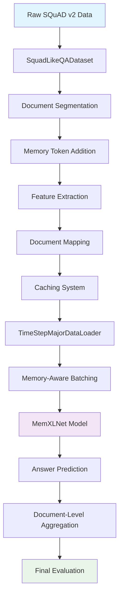
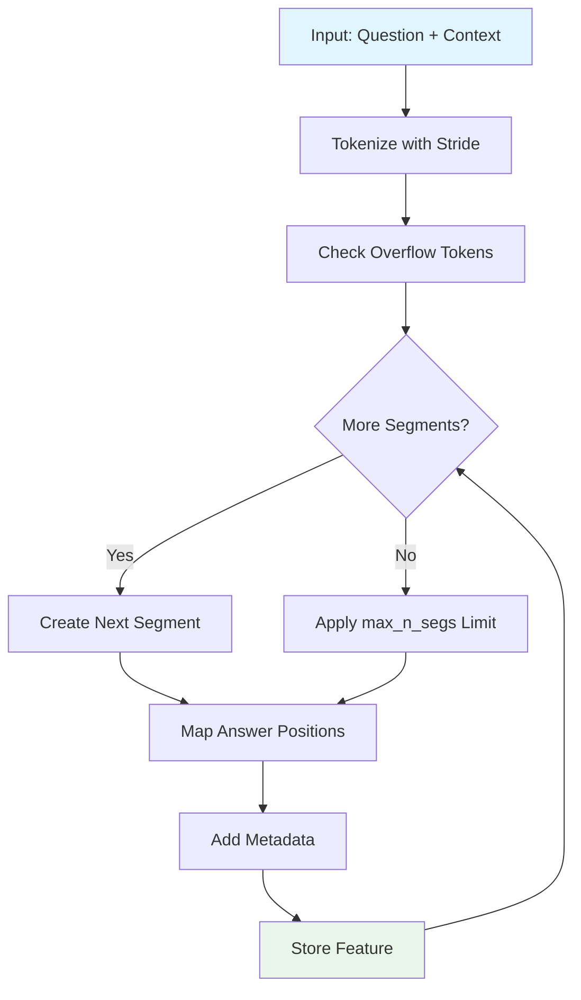
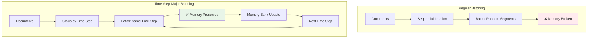
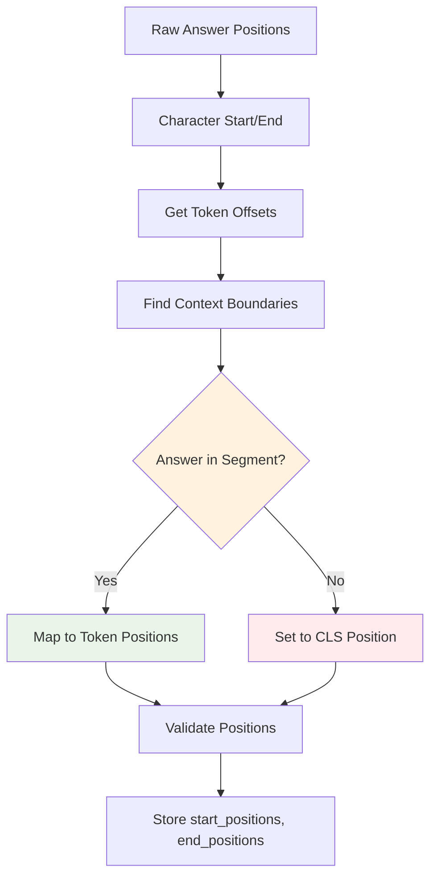
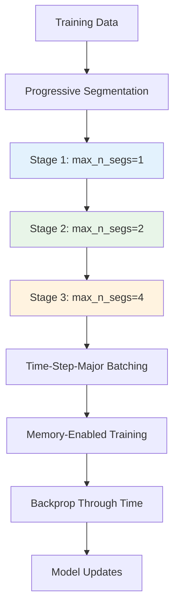
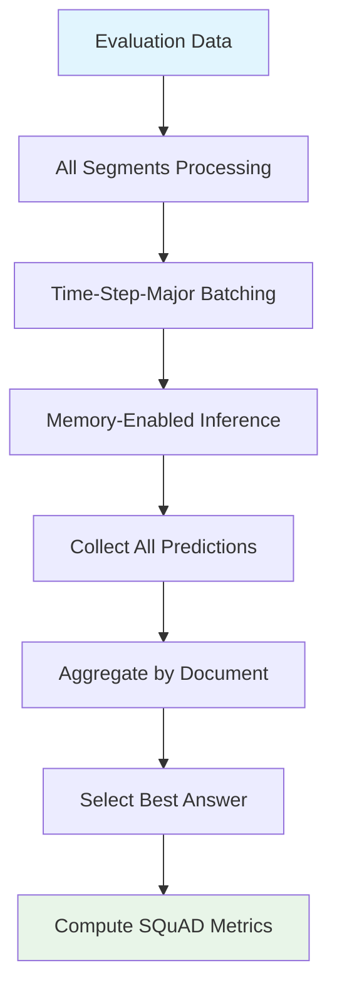
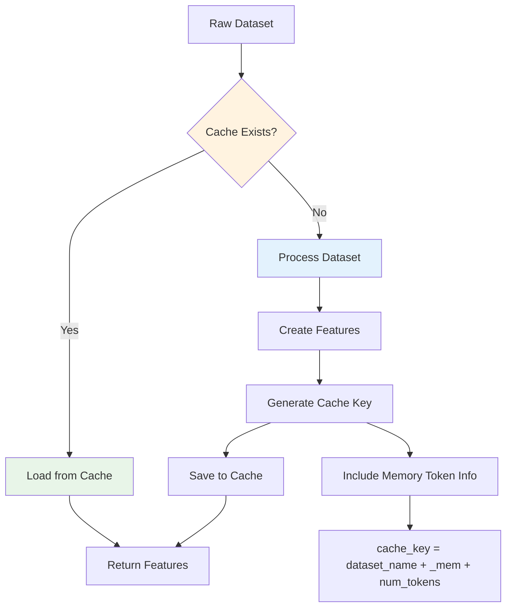

# Data Flow Diagrams for MemXLNet-QA

This document provides visual representations of how data flows through the MemXLNet-QA system, from raw input to model outputs. These diagrams help understand the complex transformations and processing steps.

## Table of Contents

1. [Overall Data Processing Flow](#overall-data-processing-flow)
2. [Document Segmentation Process](#document-segmentation-process)
3. [Memory Token Integration](#memory-token-integration)
4. [Time-Step-Major vs Regular Batching](#time-step-major-vs-regular-batching)
5. [Memory State Propagation](#memory-state-propagation)
6. [Answer Span Mapping](#answer-span-mapping)
7. [Training vs Evaluation Flow](#training-vs-evaluation-flow)
8. [Cache Management Flow](#cache-management-flow)

## Overall Data Processing Flow



### Detailed Flow Steps

```
Input: {question, context, answers}
  ↓
[Document Segmentation]
  ├─ Segment 1: question + context[0:250] + overlap
  ├─ Segment 2: question + context[186:436] + overlap
  └─ Segment N: question + context[...] + overlap
  ↓
[Memory Token Addition]
  ├─ [CLS] [MEM_READ_0] ... question [SEP] context [MEM_WRITE_0] ... [SEP]
  └─ Vocabulary: 32000 → 32000 + 2*memory_num_tokens
  ↓
[Feature Creation]
  ├─ input_ids: [101, 32000, 32001, ...]
  ├─ attention_mask: [1, 1, 1, ...]
  ├─ token_type_ids: [0, 0, 0, 1, 1, ...]
  ├─ start_positions: 15
  ├─ end_positions: 17
  └─ metadata: example_id, segment_index, offset_mapping
  ↓
[Time-Step-Major Batching]
  ├─ Time Step 1: [doc1_seg1, doc2_seg1, doc3_seg1]
  ├─ Time Step 2: [doc1_seg2, doc2_seg2, doc3_seg2]
  └─ Memory Bank: {doc1: mem1, doc2: mem2, doc3: mem3}
  ↓
[Model Processing + Answer Extraction]
```

## Document Segmentation Process

### Visual Representation

```
Original Document (1500 chars):
┌─────────────────────────────────────────────────────────────────┐
│ The Super Bowl is the annual championship game of the National │
│ Football League (NFL) in the United States, culminating a      │
│ season that begins in the late summer of the previous year...  │
└─────────────────────────────────────────────────────────────────┘

Segmentation with max_seq_length=384, doc_stride=64:

Segment 1:
┌─────────────────────────────────────────────────────────────────┐
│ [CLS] Which team won? [SEP] The Super Bowl is the annual       │
│ championship game of the National Football League (NFL)...     │
│ [384 tokens total] [SEP] [PAD] [PAD] [PAD]                     │
└─────────────────────────────────────────────────────────────────┘
           ↑_question_↑      ↑____________context____________↑

Segment 2 (64 token overlap):
┌─────────────────────────────────────────────────────────────────┐
│ [CLS] Which team won? [SEP] ...Football League (NFL) in the    │
│ United States, culminating a season that begins...             │
│ [384 tokens total] [SEP] [PAD] [PAD] [PAD]                     │
└─────────────────────────────────────────────────────────────────┘
                                ↑_____overlap_____↑

Segment 3:
┌─────────────────────────────────────────────────────────────────┐
│ [CLS] Which team won? [SEP] ...season that begins in the late  │
│ summer of the previous year and ends in early February...      │
│ [384 tokens total] [SEP] [PAD] [PAD] [PAD]                     │
└─────────────────────────────────────────────────────────────────┘
```

### Segmentation Algorithm Flow



## Memory Token Integration

### Token Vocabulary Expansion

```
Before Memory Token Addition:
┌─────────────────────────────────────────────────────────────────┐
│ XLNet Base Vocabulary: ~32,000 tokens                          │
│ [CLS], [SEP], [PAD], [MASK], regular tokens...                │
└─────────────────────────────────────────────────────────────────┘

After Memory Token Addition (memory_num_tokens=4):
┌─────────────────────────────────────────────────────────────────┐
│ Extended Vocabulary: 32,008 tokens                             │
│ Original tokens + [MEM_READ_0], [MEM_READ_1], [MEM_READ_2],   │
│ [MEM_READ_3], [MEM_WRITE_0], [MEM_WRITE_1], [MEM_WRITE_2],    │
│ [MEM_WRITE_3]                                                  │
└─────────────────────────────────────────────────────────────────┘

Token ID Mapping:
[MEM_READ_0]  → 32000    [MEM_WRITE_0] → 32004
[MEM_READ_1]  → 32001    [MEM_WRITE_1] → 32005
[MEM_READ_2]  → 32002    [MEM_WRITE_2] → 32006
[MEM_READ_3]  → 32003    [MEM_WRITE_3] → 32007
```

### Memory Token Placement in Sequences

```
Standard Sequence:
┌─────────────────────────────────────────────────────────────────┐
│ [CLS] question tokens [SEP] context tokens [SEP] [PAD] [PAD]   │
└─────────────────────────────────────────────────────────────────┘

Memory-Enhanced Sequence:
┌─────────────────────────────────────────────────────────────────┐
│ [CLS] [MEM_READ_0] [MEM_READ_1] question [SEP] context         │
│ [MEM_WRITE_0] [MEM_WRITE_1] [SEP] [PAD] [PAD]                 │
└─────────────────────────────────────────────────────────────────┘
        ↑_____read_____↑                        ↑____write____↑

Processing Flow:
1. READ tokens → embeddings replaced with memory state
2. Model processes sequence with memory information
3. WRITE tokens → hidden states extracted for memory update
4. Updated memory state → propagated to next segment
```

## Time-Step-Major vs Regular Batching

### Regular Batching (INCORRECT for Memory)

```
Document Structure:
Doc1: [seg1, seg2, seg3]
Doc2: [seg1, seg2]
Doc3: [seg1, seg2, seg3, seg4]

Regular DataLoader Output:
Batch 1: [doc1_seg1, doc2_seg1, doc3_seg1]  ← First segments
Batch 2: [doc1_seg2, doc2_seg2, doc3_seg2]  ← Second segments
Batch 3: [doc1_seg3, PADDING, doc3_seg3]    ← Third segments
Batch 4: [PADDING,   PADDING, doc3_seg4]    ← Fourth segments

Problem: Memory states from Batch 1 cannot flow to Batch 2!
```

### Time-Step-Major Batching (CORRECT for Memory)

```
TimeStepMajorDataLoader Output:

Document Batch 1: [doc1, doc2, doc3]
├─ Time Step 1: [doc1_seg1, doc2_seg1, doc3_seg1]
├─ Time Step 2: [doc1_seg2, doc2_seg2, doc3_seg2]
├─ Time Step 3: [doc1_seg3, PADDING,   doc3_seg3]
└─ Time Step 4: [PADDING,   PADDING,   doc3_seg4]

Memory Flow:
Time Step 1 → Memory Bank: {doc1: mem1, doc2: mem2, doc3: mem3}
Time Step 2 → Uses mem1, mem2, mem3 → Updates memory bank
Time Step 3 → Uses updated memory → Updates memory bank
Time Step 4 → Uses updated memory → Final memory states

✓ Memory states flow correctly across time steps!
```

### Implementation Comparison



## Memory State Propagation

### Memory Flow Across Segments

```
Document Processing with Memory:

Initial State:
Memory Bank = {}

Time Step 1 (First Segments):
┌─────────────────────────────────────────────────────────────────┐
│ Input: [doc1_seg1, doc2_seg1, doc3_seg1]                      │
│ Memory: [init_mem, init_mem, init_mem]                        │
│ ↓ Model Forward Pass ↓                                        │
│ Output: predictions + [mem1_new, mem2_new, mem3_new]          │
│ Memory Bank = {doc1: mem1_new, doc2: mem2_new, doc3: mem3_new}│
└─────────────────────────────────────────────────────────────────┘

Time Step 2 (Second Segments):
┌─────────────────────────────────────────────────────────────────┐
│ Input: [doc1_seg2, doc2_seg2, doc3_seg2]                      │
│ Memory: [mem1_new, mem2_new, mem3_new]  ← From previous step  │
│ ↓ Model Forward Pass ↓                                        │
│ Output: predictions + [mem1_upd, mem2_upd, mem3_upd]          │
│ Memory Bank = {doc1: mem1_upd, doc2: mem2_upd, doc3: mem3_upd}│
└─────────────────────────────────────────────────────────────────┘

Continue for all time steps...
```

### Memory Update Mechanism

```mermaid
graph TD
    A[Current Memory State] --> B[Extract WRITE Token States]
    B --> C[Concatenate Current + New]
    C --> D[Memory Gate Network]
    D --> E[Memory Update Network]
    E --> F[Gated Combination]
    F --> G[Updated Memory State]

    D --> H[Gate Values σ(W·[mem;new])]
    E --> I[Update Values tanh(U·[mem;new])]
    H --> F
    I --> F
    F --> J[new_mem = gate⊙update + (1-gate)⊙old_mem]

    style A fill:#e1f5fe
    style G fill:#e8f5e8
    style J fill:#fff3e0
```

## Answer Span Mapping

### Challenge: Answer Across Multiple Segments

```
Original Context with Answer:
┌─────────────────────────────────────────────────────────────────┐
│ The Denver Broncos defeated the Carolina Panthers 24-10 to win │
│ Super Bowl 50. The game was played on February 7, 2016...     │
└─────────────────────────────────────────────────────────────────┘
         ↑_____________Answer: "Denver Broncos"_____________↑

After Segmentation:
Segment 1:
┌─────────────────────────────────────────────────────────────────┐
│ [CLS] Who won? [SEP] The Denver Broncos defeated the Carolina  │
│ Panthers 24-10 to win Super Bowl 50... [SEP]                  │
└─────────────────────────────────────────────────────────────────┘
                         ↑___Answer Here___↑

Segment 2:
┌─────────────────────────────────────────────────────────────────┐
│ [CLS] Who won? [SEP] ...to win Super Bowl 50. The game was    │
│ played on February 7, 2016... [SEP]                           │
└─────────────────────────────────────────────────────────────────┘
                         ↑_No Answer Here_↑
```

### Answer Position Mapping Algorithm



### Position Mapping Example

```
Text: "The Denver Broncos defeated..."
Chars: 0123456789012345678901234567...
Answer: "Denver Broncos" (chars 4-17)

Tokenization:
Token 0: [CLS]     → chars (0,0)
Token 1: Who       → chars (0,3)
Token 2: won       → chars (4,7)
Token 3: ?         → chars (8,9)
Token 4: [SEP]     → chars (0,0)
Token 5: The       → chars (0,3)
Token 6: Denver    → chars (4,10)    ← Answer start
Token 7: Broncos   → chars (11,18)   ← Answer end
Token 8: defeated  → chars (19,27)
...

Mapping Result:
start_positions = 6  (token containing char 4)
end_positions = 7    (token containing char 17)
```

## Training vs Evaluation Flow

### Training Flow



### Evaluation Flow



### Key Differences

| Aspect | Training | Evaluation |
|--------|----------|------------|
| **Segmentation** | Progressive (1→2→4) | All segments |
| **Memory Backprop** | Yes (BPTT) | No (forward only) |
| **Loss Computation** | Per-segment + global | N/A |
| **Answer Selection** | Ground truth positions | Best confidence |
| **Batching** | Time-step-major | Time-step-major |

## Cache Management Flow

### Cache Architecture



### Cache Key Generation

```
Standard Model:
Dataset: squad_v2
Cache Key: "squad_v2_validation_chunk_0.cache"

Memory Model (16 tokens):
Dataset: squad_v2
Memory Tokens: 32 (16 read + 16 write)
Cache Key: "squad_v2_mem32_validation_chunk_0.cache"

Cache Directory Structure:
.cache/
├── squad_v2_train_chunk_0.cache           # Standard model training
├── squad_v2_validation_chunk_0.cache      # Standard model validation
├── squad_v2_mem32_train_chunk_0.cache     # Memory model training
└── squad_v2_mem32_validation_chunk_0.cache # Memory model validation
```

### Cache Workflow

```
First Run (Cache Miss):
┌─────────────────────────────────────────────────────────────────┐
│ 1. load_dataset("squad_v2") → Raw data                        │
│ 2. SquadLikeQADataset processing → Features                   │
│ 3. ChunkedCacheManager.save_chunk() → Cache files             │
│ ✓ Processing time: ~5 minutes                                 │
└─────────────────────────────────────────────────────────────────┘

Subsequent Runs (Cache Hit):
┌─────────────────────────────────────────────────────────────────┐
│ 1. ChunkedCacheManager.cache_exists() → True                  │
│ 2. ChunkedCacheManager.load_chunk() → Cached features         │
│ ✓ Loading time: ~10 seconds                                   │
└─────────────────────────────────────────────────────────────────┘
```

## Visual Summary

### Complete Data Processing Pipeline

```
Raw SQuAD v2 Data
        ↓
┌───────────────────────────────────────────────────────────────────┐
│                    Document Segmentation                         │
│  Long Context → Overlapping Segments with Answer Mapping         │
└───────────────────────────────────────────────────────────────────┘
        ↓
┌───────────────────────────────────────────────────────────────────┐
│                    Memory Token Integration                       │
│  Standard Tokens → Extended Vocab with READ/WRITE Tokens         │
└───────────────────────────────────────────────────────────────────┘
        ↓
┌───────────────────────────────────────────────────────────────────┐
│                   Time-Step-Major Batching                       │
│  Sequential Docs → All First Segments → All Second Segments      │
└───────────────────────────────────────────────────────────────────┘
        ↓
┌───────────────────────────────────────────────────────────────────┐
│                   Memory-Aware Processing                        │
│  Model + Memory Bank → Predictions + Updated Memory States       │
└───────────────────────────────────────────────────────────────────┘
        ↓
┌───────────────────────────────────────────────────────────────────┐
│                    Answer Aggregation                            │
│  Multi-Segment Predictions → Document-Level Best Answers         │
└───────────────────────────────────────────────────────────────────┘
        ↓
    Final Results
```

This comprehensive visual guide helps understand the complex data transformations that enable MemXLNet-QA to process long documents effectively while maintaining memory state and answer accuracy.

For more detailed implementation information, see:
- [DATA_PROCESSING.md](DATA_PROCESSING.md) - Detailed text descriptions
- [MEMORY_TOKENS_GUIDE.md](MEMORY_TOKENS_GUIDE.md) - Memory system specifics
- [API_REFERENCE.md](API_REFERENCE.md) - Function-level documentation