# MemXLNet-QA Architecture Diagrams for Presentation

This document provides comprehensive visualizations of the MemXLNet-QA architecture, data processing pipeline, memory mechanisms, and training workflow for presentation purposes.

---

## 1. Overall System Architecture

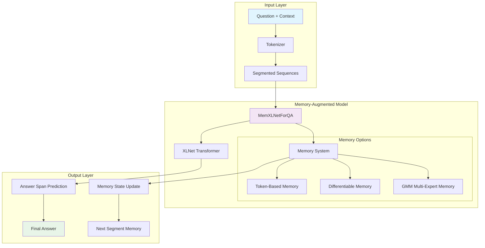

**Key Points for Presentation:**
- MemXLNet extends base XLNet with explicit memory mechanisms
- Three memory variants: Token-based, Differentiable, and GMM Multi-Expert
- Memory states persist across document segments

---

## 2. Token-Based Memory Architecture

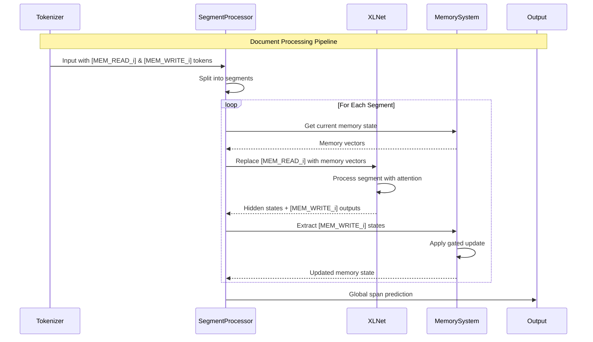

**Memory Token Flow:**

```mermaid
graph LR
    subgraph "Segment i"
        A[Question Tokens] --> B[Context Tokens]
        B --> C[MEM_READ_0...MEM_READ_m]
        C --> D[Context Tokens]
        D --> E[MEM_WRITE_0...MEM_WRITE_m]
    end

    subgraph "Memory Operations"
        F[Memory State M^(i-1)] --> G[Replace MEM_READ]
        E --> H[Extract MEM_WRITE States]
        H --> I[Gated Update]
        I --> J[Memory State M^i]
        J --> F
    end

    style C fill:#ffeb3b
    style E fill:#ff9800
    style F fill:#4caf50
    style J fill:#4caf50
```

**Key Presentation Points:**
- Explicit `[MEM_READ_i]` and `[MEM_WRITE_i]` tokens provide clear memory interface
- Gated update mechanism: `M^i = g ⊙ u + (1-g) ⊙ M^(i-1)`
- Memory states flow across segments via time-step-major batching

---

## 3. Data Processing Pipeline

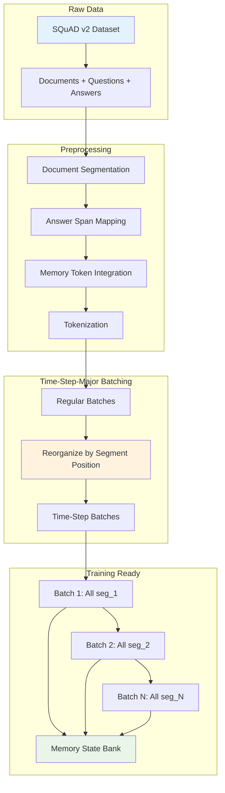

**Segment Selection Strategies:**

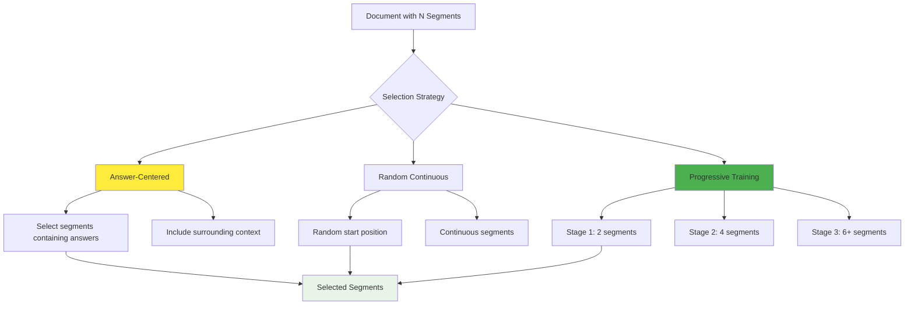

**Key Presentation Points:**
- Documents segmented with sliding window (384 tokens, 64 stride)
- Answer spans mapped across segment boundaries
- Time-step-major batching enables proper memory propagation
- Progressive training: 2→4→6 segments curriculum

---

## 4. GMM Multi-Expert Memory Architecture

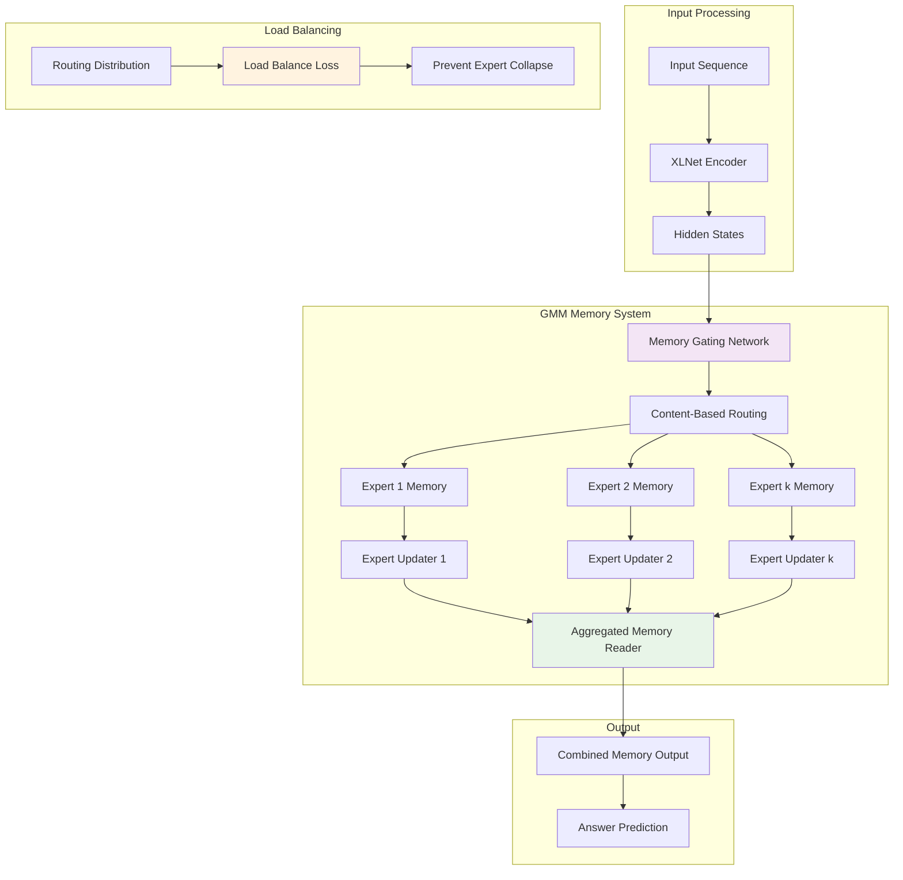

**Expert Specialization Visualization:**

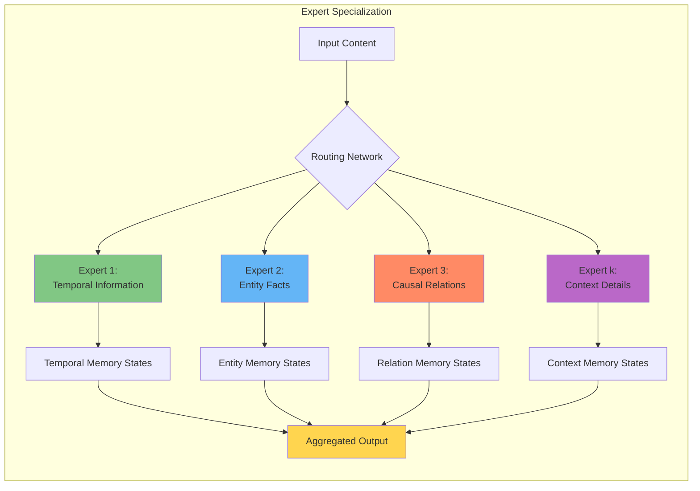

**Key Presentation Points:**
- k independent memory experts (typically k=4)
- Content-based routing directs information to appropriate experts
- Experts automatically specialize to different information types
- Load balancing prevents expert collapse

---

## 5. Training Pipeline Architecture

```mermaid
graph TB
    subgraph "Configuration"
        A[TrainingConfig] --> B[Progressive Segments: [2,4,6]]
        A --> C[Memory Tokens: 16]
        A --> D[Phase-2 Warmup Controls]
    end

    subgraph "Data Loading"
        E[Dataset] --> F[TimeStepMajorDataLoader]
        F --> G[Batch Organization]
        G --> H[Memory State Bank]
    end

    subgraph "Training Loop"
        I[XLNetRecurrentTrainer] --> J[Forward Pass]
        J --> K[Memory Update]
        K --> L[Loss Computation]
        L --> M[Backward Pass]
        M --> N[Optimizer Step]
    end

    subgraph "Progressive Stages"
        O[Stage 1: 2 segments] --> P[Stage 2: 4 segments]
        P --> Q[Stage 3: 6 segments]
    end

    B --> E
    D --> I
    H --> I
    I --> O

    style A fill:#e3f2fd
    style H fill:#f3e5f5
    style O fill:#e8f5e8
```

**Phase-2 Warmup Strategy:**

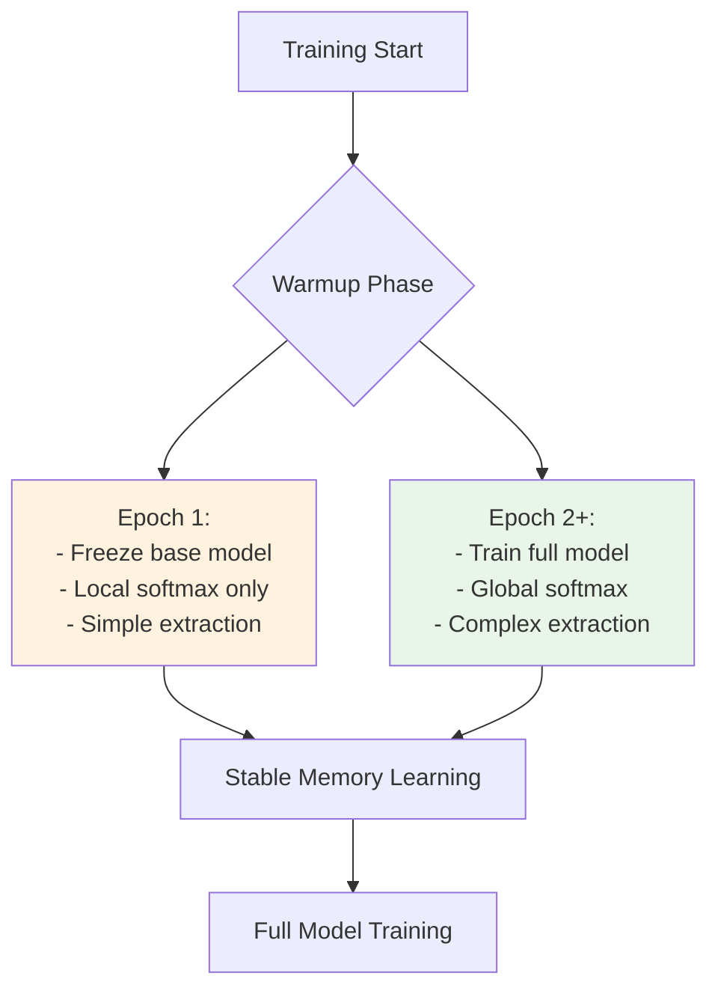

**Key Presentation Points:**
- Progressive training curriculum helps model learn incrementally
- Phase-2 warmup prevents memory instability
- Time-step-major batching ensures proper memory propagation
- Each stage trains for 3 epochs before advancing

---

## 6. Memory State Propagation Flow

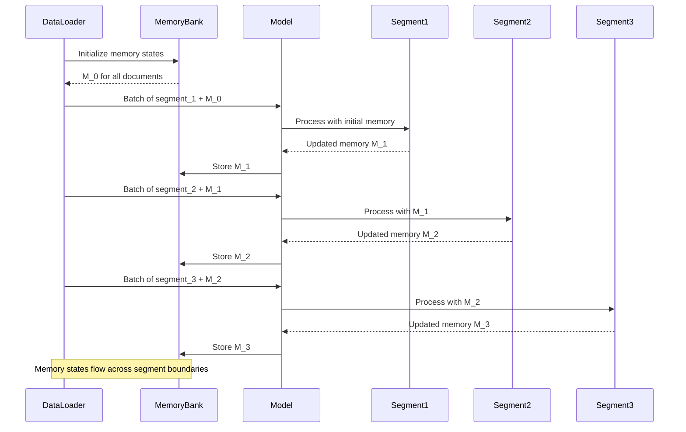

**Memory Bank Architecture:**

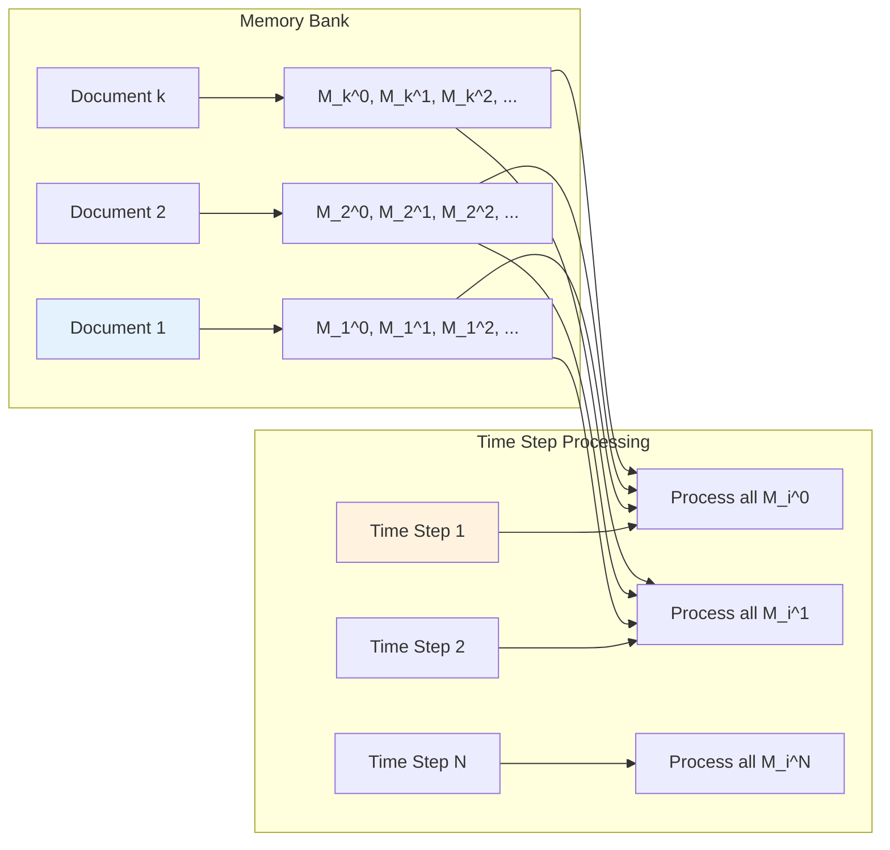

**Key Presentation Points:**
- Memory bank maintains states for all documents in batch
- Time-step processing ensures proper memory propagation
- Each document has independent memory trajectory

---

## 7. Evaluation and Performance Comparison

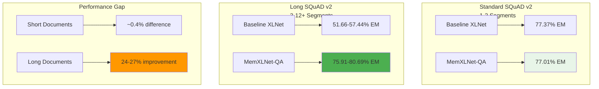

**Scaling Behavior:**

```mermaid
graph LR
    A[Document Length] --> B[1-2 Segments]
    A --> C[3 Segments]
    A --> D[6 Segments]
    A --> E[12+ Segments]

    B --> F[77% EM<br/>(Baseline + Memory)]
    C --> G[57% vs 81% EM<br/>(+24% improvement)]
    D --> H[52% vs 79% EM<br/>(+27% improvement)]
    E --> I[52% vs 76% EM<br/>(+24% improvement)]

    style F fill:#e8f5e8
    style G fill:#4caf50
    style H fill:#4caf50
    style I fill:#4caf50
```

**Key Presentation Points:**
- Competitive performance on standard benchmarks
- Dramatic improvements on long documents (40-50% relative gain)
- Performance gap scales with document length
- Validates explicit memory for long-context understanding

---

## 8. Differentiable Memory Architecture

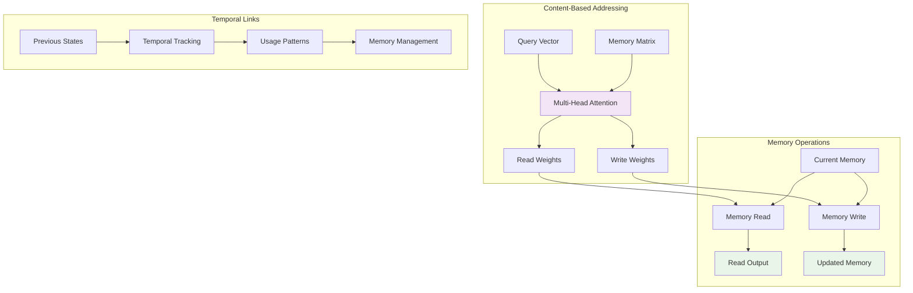

**Key Presentation Points:**
- Alternative to token-based memory
- Content-based addressing with multi-head attention
- Temporal links track memory usage patterns
- More flexible but computationally expensive

---

## 9. Implementation Summary for Presentation

### Core Components to Highlight:

1. **Memory Token Interface**: `[MEM_READ_i]` and `[MEM_WRITE_i]` tokens
2. **Time-Step-Major Batching**: Unique batching for memory propagation
3. **Progressive Training**: 2→4→6 segments curriculum
4. **Gated Memory Updates**: Stable memory evolution
5. **GMM Multi-Expert**: Specialized memory banks

### Key Innovation Points:

1. **Explicit vs Implicit Memory**: Clear interface vs hidden states
2. **Scalability**: Performance improves with document length
3. **Flexibility**: Multiple memory implementations
4. **Training Stability**: Warmup and progressive strategies

### Presentation Flow Suggestions:

1. **Problem**: Long-context QA challenges
2. **Solution**: MemXLNet architecture
3. **Innovation**: Explicit memory tokens
4. **Mechanism**: Time-step-major batching
5. **Results**: Dramatic improvements on long documents
6. **Extension**: GMM multi-expert memory

---

## 10. Quick Reference Diagram Sizes

For different presentation contexts:

- **High-Level Overview**: Use diagrams 1, 7, 9
- **Technical Deep Dive**: Use diagrams 2, 3, 5, 6
- **Memory Focus**: Use diagrams 2, 4, 8
- **Training Focus**: Use diagrams 5, 6
- **Results Focus**: Use diagram 7

All diagrams are created using Mermaid syntax and can be rendered in various presentation tools that support Mermaid, or converted to images for traditional presentation software.